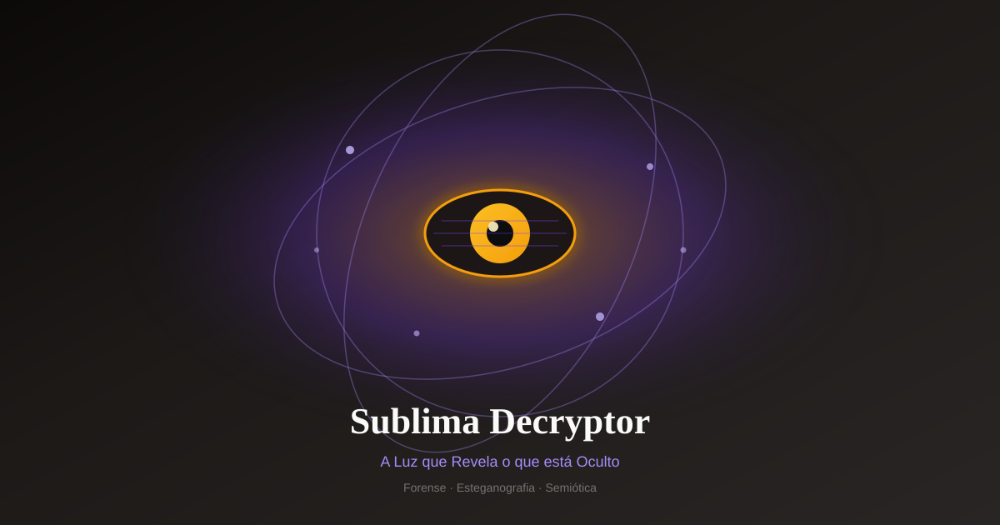

# 🔮 Sublima Decryptor

<p align="center">
  
</p>

**A Luz que Revela o que está Oculto**

> Plataforma de análise forense digital, esteganografia, semiótica computacional e decodificação de mensagens subliminares.

**Producer DCS®** | v0.1.0 — Foundation  
**Licença:** MIT  
**Repositório:** [producerdcs-cpu/sublima-decryptor](https://github.com/producerdcs-cpu/sublima-decryptor)

---

## 🎯 O que é

O **Sublima Decryptor** detecta, extrai e interpreta **códigos subliminares, esteganográficos, simbólicos e mensagens ocultas** em praticamente qualquer tipo de arquivo:

| Tipo | Formatos |
|------|----------|
| **Imagens** | JPG, PNG, WEBP, TIFF, SVG, GIF |
| **Vídeo** | MP4, MOV, AVI, WebM |
| **Áudio** | MP3, WAV, FLAC, OGG |
| **Documentos** | PDF, DOCX, PPTX, TXT |
| **Código** | Python, JS, C++, Rust, Go, HTML, Assembly |
| **Outros** | Binários, memes, capas de revista, NFTs, QR codes |

---

## ✨ Capacidades (visão do produto)

1. **Análise Multimodal Automática**  
   Esteganografia (LSB, DCT, F5…), frequência, metadados ocultos, OCR avançado, microtextos.

2. **Interpretação Simbólica e Narrativa**  
   Símbolos políticos, religiosos, corporativos, meméticos · árvore de significados · narrativas subliminares.

3. **Deep Scan**  
   Múltiplos modelos de visão e linguagem + modo local para privacidade.

4. **Relatórios Forenses**  
   Exportação PDF profissional com camadas de interpretação.

5. **Modo Criador** *(roadmap)*  
   Gerar mídia com mensagens ocultas (testes e educação).

---

## 🏗️ Stack planejada

| Camada | Tecnologia |
|--------|------------|
| **Frontend** | Next.js 15 · Tailwind · shadcn/ui · Three.js |
| **Backend** | Python · FastAPI · Celery |
| **IA** | Visão + LLM · modelos de esteganografia |
| **Dados** | PostgreSQL + pgvector |
| **Deploy** | Docker · Vercel · Railway / AWS |

---

## 📁 Estrutura

```
sublima-decryptor/
├── README.md
├── assets/logo.svg
├── docs/
├── prompts/
├── examples/
├── backend/
├── frontend/
└── .gitignore
```

---

## 🗺️ Status

| Fase | Nome | Status |
|------|------|--------|
| 0 | Foundation | ✅ |
| 1 | MVP | 📋 |
| 2 | Multimodal | 📋 |
| 3 | Deep Scan | 📋 |
| 4 | Plataforma | 📋 |

Detalhes em [docs/ROADMAP.md](docs/ROADMAP.md).

---

## 🔬 Exemplo

Análise da capa **The Economist — The World Ahead 2026**  
→ [examples/economist-2026.md](examples/economist-2026.md)

---

## ⚠️ Disclaimer

Pesquisa, educação e forense digital legítima. Interpretações especulativas sempre com disclaimer.

---

## 📄 Licença

MIT © 2026 Producer DCS · [producerdcs-cpu](https://github.com/producerdcs-cpu)

**Sublima Decryptor** — *O que está oculto merece ser compreendido, não temido.*
